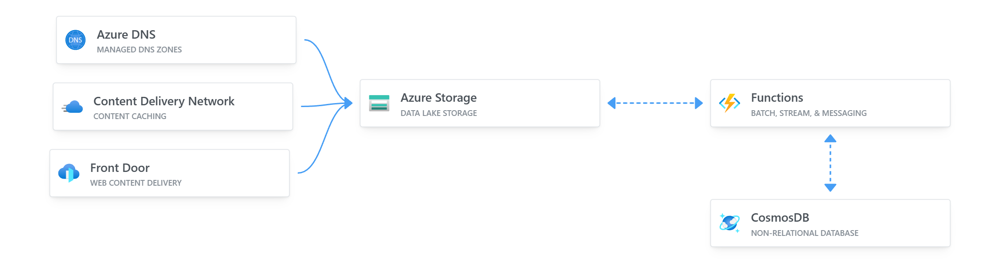

# Azure Resume

This is my resume built on Azure. It's a static website hosted on Azure Storage, with a visitor counter built on Azure Functions. The website is built with HTML, CSS, and JavaScript. The visitor counter is built with .NET and Azure Functions. 

 

## Structure

- `frontend/`: Folder contains the website.
    - `main.js`: Folder contains visitor counter code.
- `api/`: Folder contains the dotnet API deployed on Azure Functions.
    - `Counter.cs`: Contains the visitor counter code.
- `.github/workflows/`: Folder contains CI/CD workflow configurations.

## Frontend resources

The front-end is a static site with HTML, CSS, and JavaScript. It's static and has a visitor counter. The visitor counter data fetched via an API call to an Azure Function.

## Backend resources

The back-end is an [HTTP triggered Azure Functions](https://docs.microsoft.com/en-us/azure/azure-functions/functions-bindings-http-webhook-trigger?tabs=csharp) with Cosmos DB input and output binding. The Function is triggered, it retrieves the CosmosDB item, adds 1 to it, and saves it and returns its value to the caller.

## Testing Resources

[Testing is important](https://dev.to/flippedcoding/its-important-to-test-your-code-3lid), though my tests are simple, they exist. I am using .NET but some of these resources will apply to any language.

- [Testing Azure Functions.](https://techcommunity.microsoft.com/t5/fasttrack-for-azure/azure-functions-part-2-unit-and-integration-testing/ba-p/3769764) 

## CI/CD Resources

- This is how you can deploy a blob storage static site with [GitHub actions.](https://docs.microsoft.com/azure/storage/blobs/storage-blobs-static-site-github-actions)
- This is how you can [deploy an Azure Function to Azure with GitHub Actions.](https://github.com/marketplace/actions/azure-functions-action)
- [Implement .NET testing in GitHub Actions.](https://docs.github.com/en/actions/guides/building-and-testing-net)
